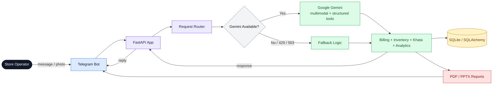

# 🏗️ Kirana Ops Agent — Architecture

This is a simple runtime view of the system:

- Operator sends messages/photos in Telegram.
- FastAPI handles the request and routes it.
- Gemini is used for multimodal understanding and structured actions when available.
- A fallback path handles service overload or quota errors.
- Billing, inventory, Khata, and analytics logic update SQLite through SQLAlchemy.
- Reports are generated as PDFs/PPTX files and sent back to Telegram.
