# 🏗️ Kirana Ops Agent — Architecture

A concise view of the request path and the systems behind the supermarket assistant.

```mermaid
%%{init: {
  "theme": "base",
  "flowchart": { "htmlLabels": true, "curve": "linear", "nodeSpacing": 28, "rankSpacing": 44 },
  "themeVariables": {
    "fontFamily": "Inter, Arial, sans-serif",
    "primaryTextColor": "#172033",
    "lineColor": "#64748b",
    "clusterBkg": "#f8fafc",
    "clusterBorder": "#cbd5e1"
  }
}}%%
flowchart LR
    user([Store operator])

    subgraph interface["1 · INTERFACE"]
        tg["Telegram Bot API<br/><small>text · images · replies</small>"]
    end

    subgraph runtime["2 · APPLICATION"]
        api["FastAPI + Python<br/><small>app.main</small>"]
        router["Message router<br/><small>conversation context</small>"]
        guard{"Gemini available?"}
    end

    subgraph services["3 · DOMAIN SERVICES"]
        ops["Store operations<br/><small>billing · inventory · Khata · analytics</small>"]
        reports["Report generation<br/><small>PDF invoices · PPTX summaries</small>"]
    end

    subgraph data["4 · DATA & INTEGRATIONS"]
        db[("SQLite\nSQLAlchemy")]
        ai["Google Gemini<br/><small>multimodal · structured tools</small>"]
        files[("PDF / PPTX artifacts")]
    end

    user -->|message or photo| tg
    tg <--> api
    api --> router --> guard
    guard -->|yes| ai
    ai -->|structured response| ops
    guard -->|no · 429 / 503| ops
    ops <--> db
    ops --> reports --> files
    files -->|download| tg
    ops -->|reply| api

    classDef actor fill:#0f172a,stroke:#0f172a,color:#ffffff;
    classDef interface fill:#e0f2fe,stroke:#0284c7,color:#0c4a6e;
    classDef application fill:#ede9fe,stroke:#7c3aed,color:#3b0764;
    classDef domain fill:#dcfce7,stroke:#16a34a,color:#14532d;
    classDef integration fill:#ffedd5,stroke:#ea580c,color:#7c2d12;
    classDef decision fill:#fef3c7,stroke:#d97706,color:#78350f;
    class user actor;
    class tg interface;
    class api,router application;
    class ops,reports domain;
    class db,ai,files integration;
    class guard decision;

    style interface fill:#f8fbff,stroke:#bae6fd,stroke-width:1px
    style runtime fill:#faf9ff,stroke:#ddd6fe,stroke-width:1px
    style services fill:#f7fdf8,stroke:#bbf7d0,stroke-width:1px
    style data fill:#fffaf5,stroke:#fed7aa,stroke-width:1px
```

## Runtime flow

1. The operator sends text or an image through Telegram.
2. FastAPI routes the request and prepares conversational context.
3. Gemini interprets the request and returns structured tool data when available.
4. Domain services update billing, inventory, Khata, or analytics data through SQLAlchemy.
5. SQLite stores the operational data; invoices and summaries are generated as PDF/PPTX files.
6. If Gemini is unavailable (`429`/`503`), the fallback path continues through the operations layer.

## Deployment

The application runs with `python -m app.main` in GitHub Codespaces or locally. Telegram and Gemini credentials are supplied through repository secrets or a local `.env` file.
