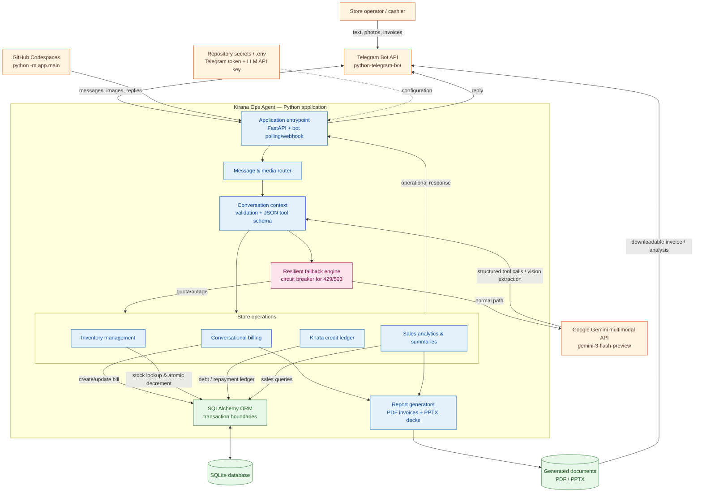

# 🏗️ Kirana Ops Agent — Architecture Diagram

This diagram shows the main runtime flow from a store operator using Telegram through the application services, AI integrations, persistence layer, and generated reports.

## Request flow

1. A cashier sends text or an image through Telegram.
2. The Python application routes the message and builds conversational context.
3. The fallback engine calls Gemini for natural-language understanding and multimodal extraction when the service is available.
4. Structured tool calls are dispatched to billing, inventory, Khata, or analytics services.
5. SQLAlchemy persists changes in SQLite, including transactional inventory updates.
6. PDF invoices and PPTX analysis decks are generated when requested and returned through Telegram.
7. When Gemini returns a quota or availability error (`429`/`503`), the circuit breaker routes the request to the resilient local fallback path instead of failing silently.

## Deployment boundary

The application runs with `python -m app.main` in GitHub Codespaces. Telegram and Gemini credentials are supplied through repository secrets in Codespaces or through a local `.env` file during local development.
